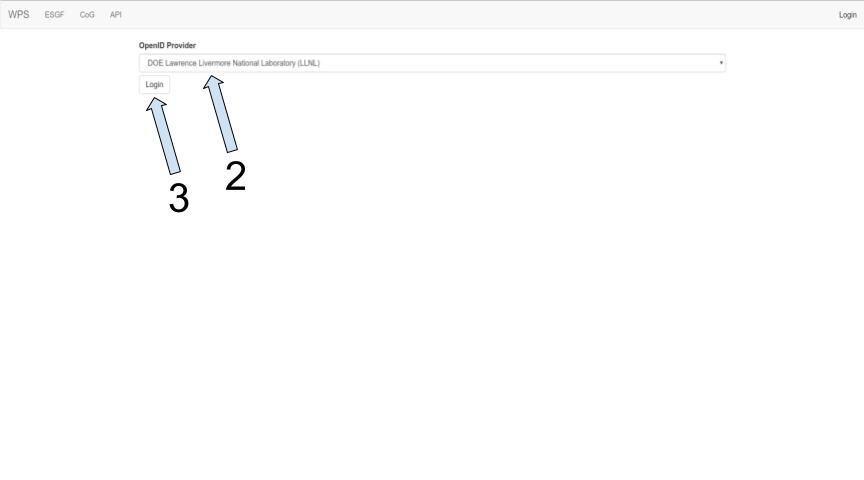
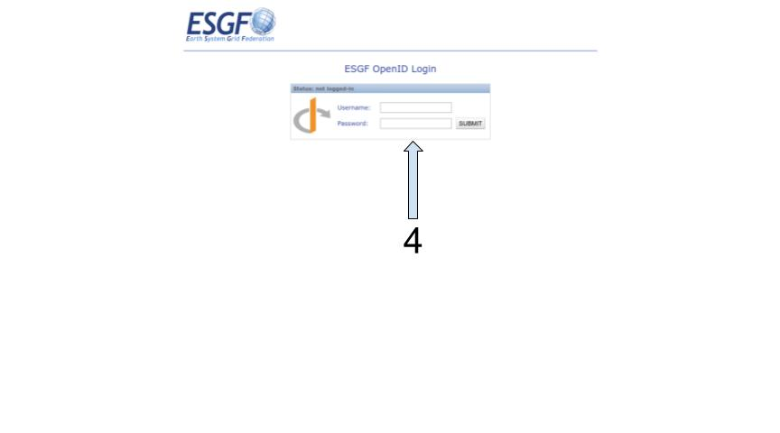
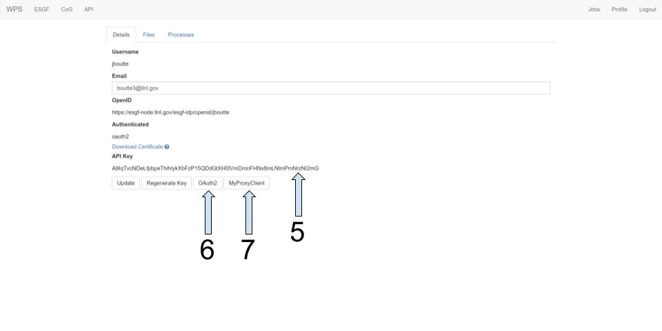

# Retrieving an API Token

> Some of the [ESGF](https://esgf.llnl.gov/) [WPS](https://www.opengeospatial.org/standards/wps) services may require a token to access their compute resources. Below you will find instructions to retrieve an API token for the [LLNL WPS service](https://aims2.llnl.gov/).

### LLNL WPS Home page
---

1. Click the login link, this will redirect you to a page to select an ESGF Identity Provider (IdP).

### Selecting an ESGF IdP 
---

2. Select your preferred IdP.
3. Click the login button, this will redirect you to the IdP's login page.

### Logging into the ESGF IdP
---

4. Sign in with your credentials. In this example the LLNL IDP was used. After you sign in you will be redirected to the profile page on the LLNL Compute service.

### Profile Page
---

5. This is the token/API key you will need to use with the esgf-compute-api library to access the compute resources at LLNL.
 * If you require access to data that is protected like CMIP3/CMIP5 then you will need to choose from the following two steps 6 or 7.
6. Click the OAuth2 button to start the process of authorizing the LLNL Compute service to retrieve certificates on your behalf to access protected data.
7. Click the MyProxyClient button to login and allow the LLNL Compute service to retrieve a certificate from the MyProxyClient service. **NOTE: These certificates are only valid for a short time and you must re-login once they have, to retrieve a new certificate**
